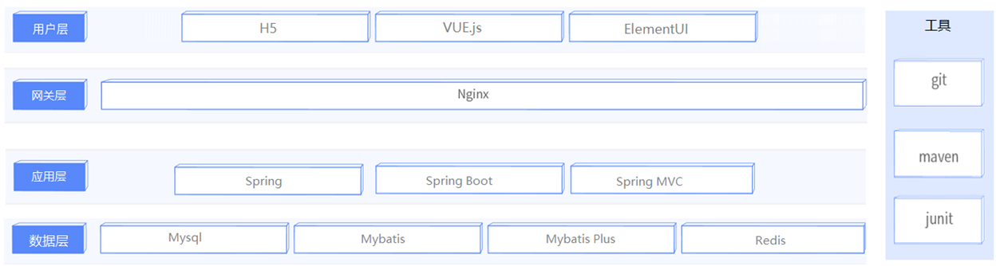

# reggie
学习自用springboot项目
## 项目介绍

本项目是专门为餐饮企业定制的一款`外卖点餐`的软件产品，包括==系统管理后台==和==移动端应用==两部分。

**系统管理后台：**主要提供给餐饮企业内部员工使用，可以对餐厅的分类、菜品、套餐、订单、员工等进行管理维护。

**移动端：**应用主要提供给消费者使用，可以在线浏览菜品、添加购物车、下单等。

### 功能架构

 

**1). 移动端前台功能**

手机号登录 , 微信登录 , 收件人地址管理 , 用户历史订单查询 , 菜品规格查询 , 购物车功能 , 下单 , 分类及菜品浏览。


**2). 系统管理后台功能**

员工登录/退出 , 员工信息管理 , 分类管理 , 菜品管理 , 套餐管理 , 菜品口味管理 , 订单管理 。

## 技术选型

关于本项目的技术选型, 我们将会从 用户层、网关层、应用层、数据层进行介绍，对服务端开发工程师来说，主要关注应用层及数据层技术。



```
1. 用户层
	本项目中在构建系统管理后台的前端页面，我们会用到H5、Vue.js、ElementUI等技术。而在构建移动端应用时，我们会使用到微信小程序。

2. 网关层
	Nginx是一个服务器，主要用来作为Http服务器，部署静态资源，访问性能高。

3. 应用层
	SpringBoot + Spring + SpringMVC

4. 数据层
	MySQL：本项目的核心业务数据都会采用MySQL进行存储。
	MybatisPlus： 本项目持久层将会使用MybatisPlus来简化开发，基本的单表增删改查直接调用框架提供的方法即可。
	Redis： 内存数据库，访问速度快,，经常使用它做缓存(降低数据库访问压力, 提供访问效率)，在后面的性能优化中会使用。

5. 工具
	junit：单元测试工具，开发人员功能实现完毕后，需要通过junit对功能进行单元测试。
	git: 版本控制工具，在团队协作中，使用该工具对项目中的代码进行管理。
	maven: 项目构建工具。
```


## 项目收获

- 是项目也是复习： 锻炼业务开发能力，综合运用前期学习技术（maven、SpringMVC、SpringBoot、Mybatis）
- 掌握项目开发技巧：接口分析、业务开发技巧
- 新技术学习：OSS 短信服务 git Linux Redis MySql读写分离

